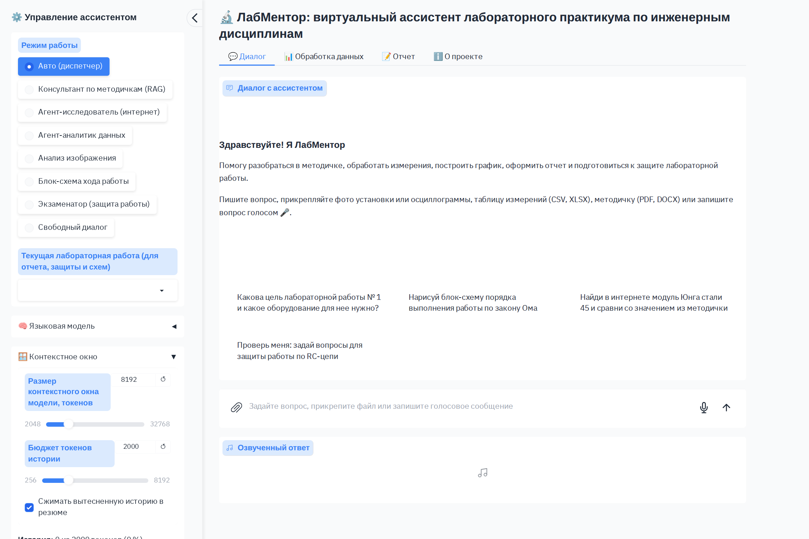
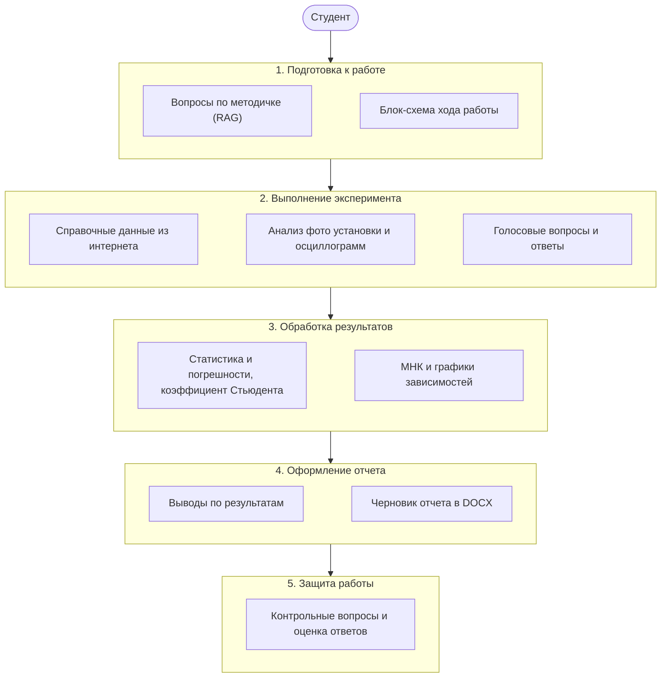
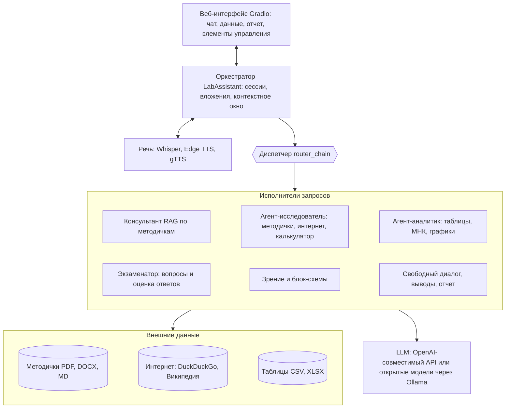
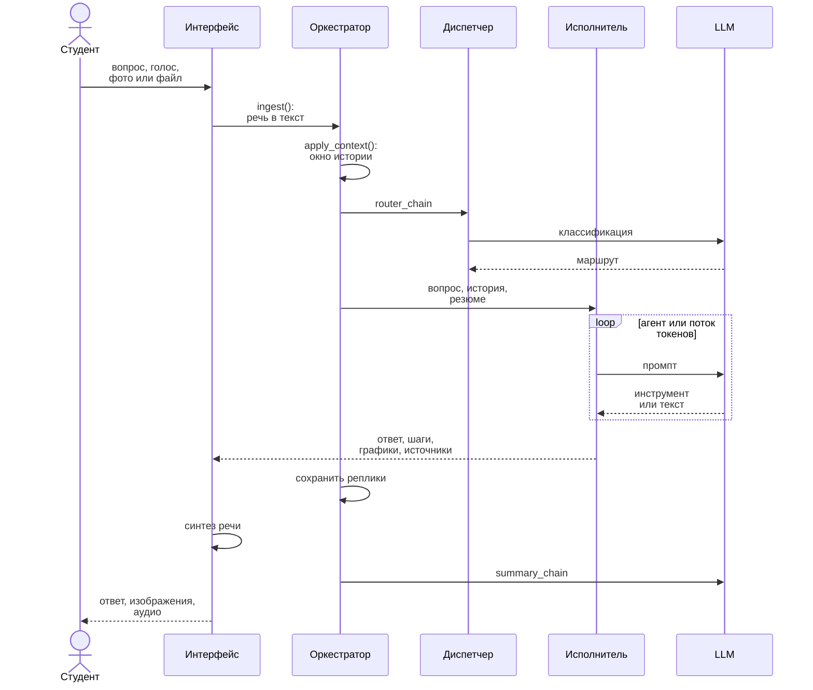
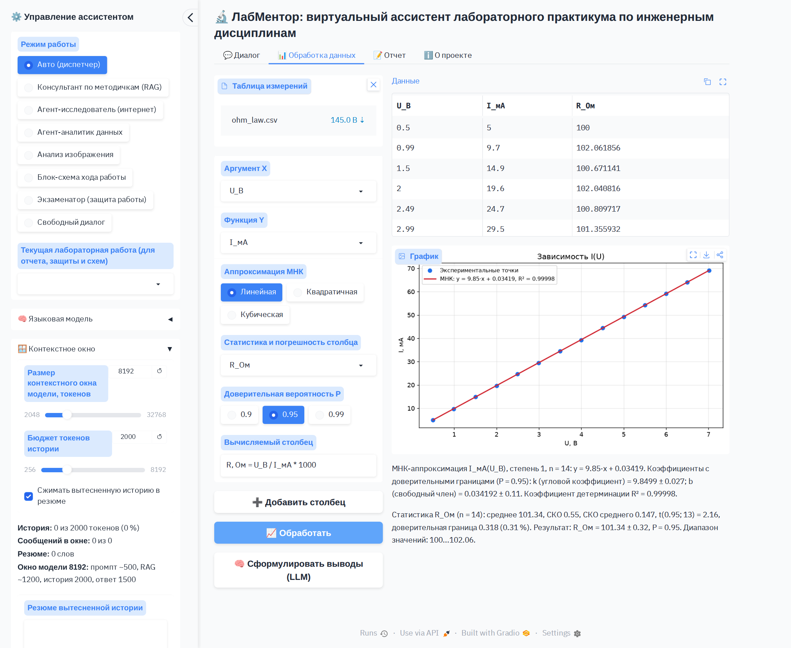
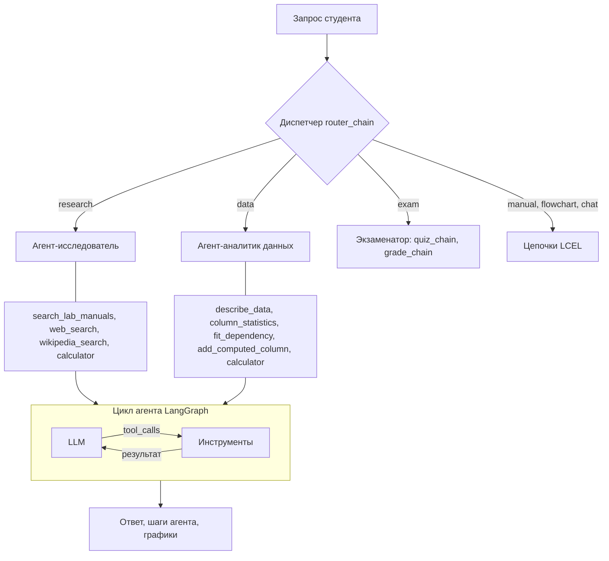
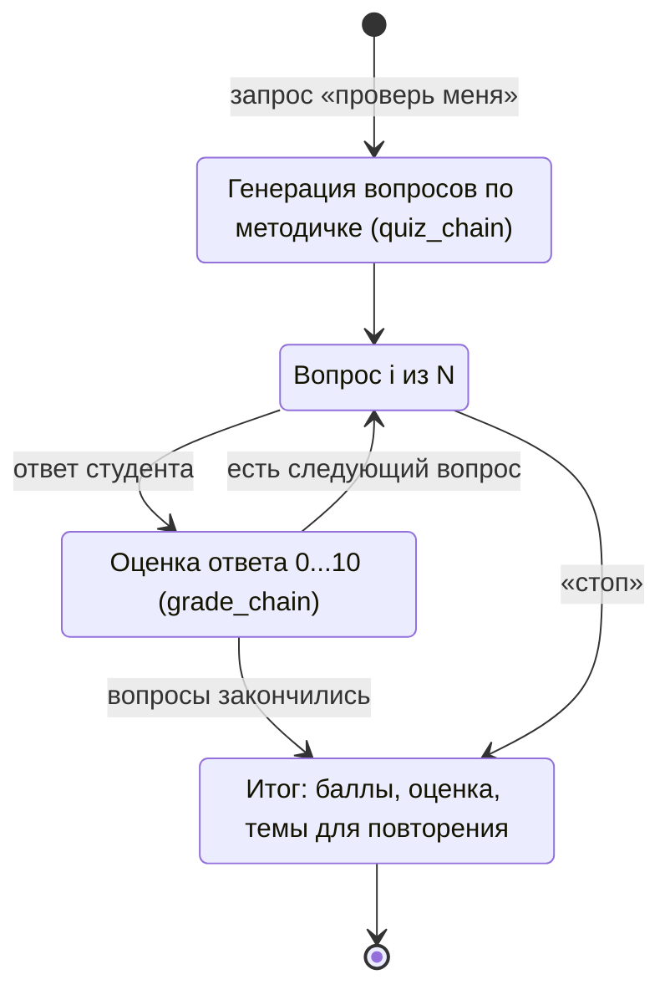
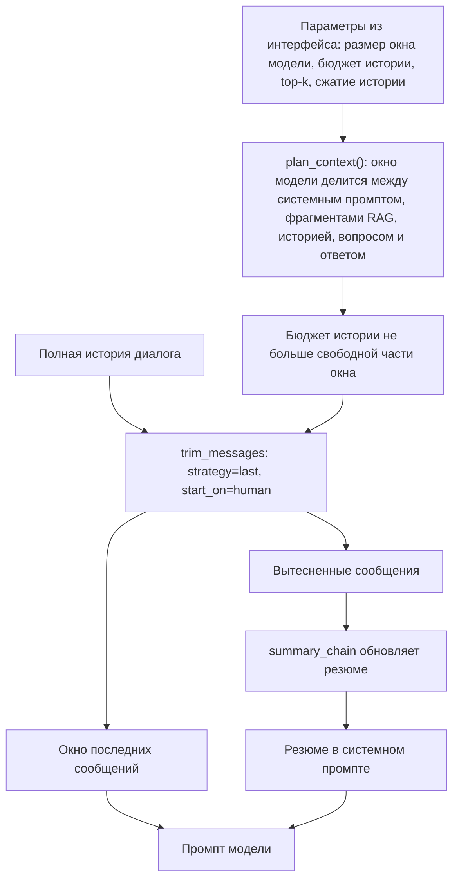
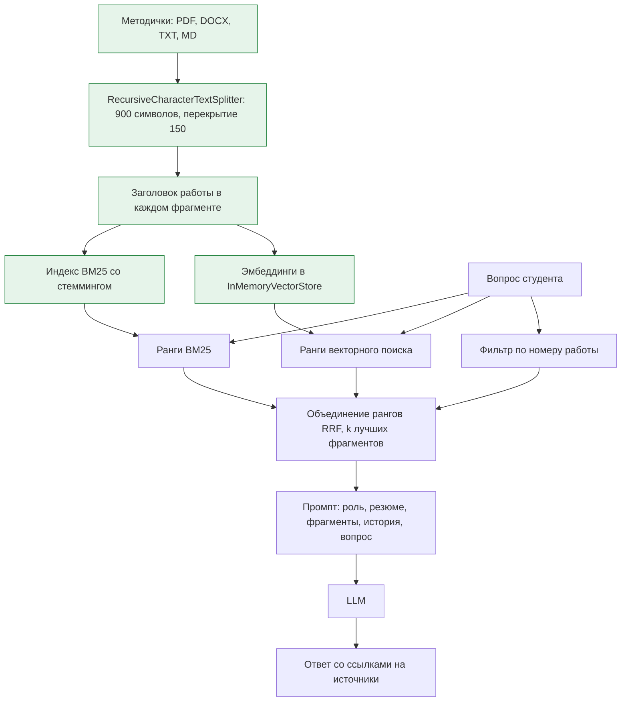

# ЛабМентор: виртуальный ассистент лабораторного практикума

Проект по дисциплине «Научно-исследовательский семинар "Искусственный интеллект в инженерном образовании"».

**ЛабМентор** сопровождает студента инженерного направления на всех этапах лабораторной работы:
подготовка по методическим указаниям, поиск справочных данных, анализ фотографий установки и
осциллограмм, обработка результатов измерений (статистика, погрешности, метод наименьших квадратов,
графики), оформление отчета и тренировочная защита работы. Ассистент построен на LLM и LangChain,
работает как веб-приложение на Gradio и поддерживает как OpenAI-совместимые API, так и открытые
модели через Ollama.



## Содержание

1. [Возможности](#возможности)
2. [Соответствие требованиям задания](#соответствие-требованиям-задания)
3. [Архитектура](#архитектура)
4. [Структура проекта](#структура-проекта)
5. [Установка и запуск](#установка-и-запуск)
6. [Настройки](#настройки)
7. [Как пользоваться](#как-пользоваться)
8. [Демонстрация на защите](#демонстрация-на-защите)
9. [Цепочки и агенты LangChain](#цепочки-и-агенты-langchain)
10. [Контекстное окно](#контекстное-окно)
11. [RAG по методическим указаниям](#rag-по-методическим-указаниям)
12. [Тестирование](#тестирование)
13. [Ограничения](#ограничения)

## Возможности

| Этап лабораторной работы | Что делает ассистент |
|---|---|
| Подготовка | Отвечает на вопросы по методичке (цель, теория, порядок выполнения, формулы, техника безопасности) со ссылками на источник; рисует блок-схему хода работы |
| Выполнение | Находит справочные данные в интернете и Википедии; анализирует фото установки, схемы, осциллограммы и графики; принимает вопросы голосом и озвучивает ответы |
| Обработка результатов | Загружает таблицы CSV/XLSX (в том числе с разделителем «;», десятичной запятой и кодировкой cp1251), считает среднее, СКО, доверительный интервал с коэффициентом Стьюдента, выполняет МНК-аппроксимацию с погрешностями коэффициентов и строит графики |
| Оформление отчета | Формулирует выводы по результатам и собирает черновик отчета в DOCX с таблицей измерений и графиком |
| Защита | Проводит тренировочную защиту: генерирует контрольные вопросы по методичке, оценивает ответы по шкале 0...10 и выставляет итоговую оценку |

Режим работы выбирается вручную или автоматически: в режиме «Авто» запрос распределяет диспетчер.

## Соответствие требованиям задания

| № | Требование | Реализация |
|---|---|---|
| 1 | Чат-бот или приложение | Web-приложение на Gradio 6 (`labmentor/ui.py`) |
| 2 | Элементы управления | Режим работы, выбор лабораторной работы, провайдер и модель, температура, размер окна модели, бюджет истории, сжатие истории, top-k, загрузка методичек, озвучивание и голос, доступ в интернет, число вопросов на защите, кнопки обработки данных, отчета и очистки диалога |
| 3 | Ввод и генерация текста | Чат с потоковой генерацией ответа, ответы со ссылками на источники, выводы и отчет |
| 4 | Дополнительная модальность | Изображения: анализ фото мультимодальной LLM, генерация графиков и блок-схем. Речь: распознавание (Whisper) и синтез (Edge TTS, gTTS) |
| 5 | Внешние данные | Текстовые файлы (методички PDF, DOCX, TXT, MD), таблицы (CSV, XLSX), интернет (DuckDuckGo, Википедия) |
| 6 | Контекстное окно (LangChain) | `trim_messages` с бюджетом токенов, план распределения окна модели, резюме вытесненной истории (`labmentor/memory.py`) |
| 7 | Не менее двух цепочек | 10 цепочек LCEL (`labmentor/chains.py`) |
| 8 | RAG, два агента, открытая LLM | Все три варианта: гибридный RAG, два агента `create_agent` с инструментами, открытые LLM через Ollama |

## Архитектура

Этапы работы, на которых помогает ассистент:



Компоненты системы:



Обработка одного запроса:



Изображения диаграмм лежат в каталоге [`docs/diagrams`](docs/diagrams).

## Структура проекта

```
Project-assistant/
  app.py                      # точка входа: запуск веб-приложения
  labmentor/
    config.py                 # настройки из .env
    llm.py                    # фабрика LLM (OpenAI-совместимый API, Ollama) и эмбеддингов
    memory.py                 # контекстное окно: план окна, trim_messages, резюме
    knowledge.py              # RAG: загрузка документов, BM25 + векторный поиск, RRF
    chains.py                 # 10 цепочек LCEL и парсеры ответов
    agents.py                 # агент-исследователь и агент-аналитик (create_agent)
    tools.py                  # инструменты агентов: интернет, Википедия, калькулятор, таблицы
    data_analysis.py          # таблицы, статистика, коэффициент Стьюдента, МНК, формулы
    graphics.py               # графики МНК и блок-схемы (matplotlib)
    speech.py                 # распознавание и синтез речи
    report.py                 # экспорт отчета в DOCX
    assistant.py              # оркестратор: сессии, диспетчер, исполнители, экзаменатор
    ui.py                     # интерфейс Gradio
  data/
    manuals/                  # методические указания к трем лабораторным работам
    samples/                  # примеры таблиц измерений и осциллограммы
    eval/golden_set.json      # эталонные вопросы и правильные ответы
  docs/
    diagrams/                 # исходники Mermaid и изображения схем
    screenshots/              # скриншоты интерфейса
    report/                   # отчет по проектному заданию
    TESTING.md                # описание и результаты тестирования
  scripts/
    smoke_test.py             # проверка всех функций на настоящей модели
    evaluate.py               # оценка качества ответов на эталонном наборе
    make_samples.py           # генерация демонстрационных данных
  tests/                      # автотесты: модульные, интеграционные, браузерные
  requirements.txt            # зависимости приложения
  requirements-dev.txt        # зависимости для тестов
  .env.example                # пример настроек
```

## Установка и запуск

**Шаг 1. Python.** Нужен Python 3.10 или новее (рекомендуется 3.11 или 3.12) с сайта
[python.org](https://www.python.org/downloads/). При установке на Windows отметьте пункт
«Add python.exe to PATH».

**Шаг 2. Код проекта.** Скачайте репозиторий командой
`git clone https://github.com/OlegSanMos/Project-assistant.git` или архивом
(кнопка Code, затем Download ZIP) и откройте терминал в папке проекта.

**Шаг 3. Виртуальное окружение и зависимости** (установка занимает несколько минут).

Windows (PowerShell):

```powershell
python -m venv .venv
.venv\Scripts\Activate.ps1
pip install -r requirements.txt
copy .env.example .env
```

Если PowerShell запрещает запуск скрипта активации, один раз выполните
`Set-ExecutionPolicy -Scope CurrentUser RemoteSigned`.

macOS и Linux:

```bash
python3 -m venv .venv
source .venv/bin/activate
pip install -r requirements.txt
cp .env.example .env
```

**Шаг 4. Модель.** Откройте файл `.env` в любом текстовом редакторе и выберите один из вариантов.

*Вариант 1. OpenAI-совместимый API* (самый быстрый, нужен ключ и оплата запросов):

```ini
LLM_PROVIDER=openai
OPENAI_API_KEY=ваш_ключ
# для сервиса-посредника, например ProxyAPI:
# OPENAI_BASE_URL=https://api.proxyapi.ru/openai/v1
```

Если сервис не поддерживает эмбеддинги или распознавание речи (например, OpenRouter), добавьте
`EMBEDDINGS_PROVIDER=none` (поиск по методичкам будет работать через BM25) и `STT_ENGINE=local`.

*Вариант 2. Открытые модели через Ollama* (бесплатно, работает на компьютере без интернета).
Установите [Ollama](https://ollama.com), затем загрузите модели:

```bash
ollama pull qwen2.5:7b      # диалоговая модель с поддержкой инструментов
ollama pull qwen2.5vl:7b    # мультимодальная модель для изображений
ollama pull bge-m3          # многоязычные эмбеддинги для RAG
```

В `.env` укажите `LLM_PROVIDER=ollama`. Модели 7B требуют около 8 ГБ свободной памяти; на слабом
компьютере загрузите `qwen2.5:3b` и `gemma3:4b` и укажите `CHAT_MODEL=qwen2.5:3b`,
`VISION_MODEL=gemma3:4b`. Речь распознает локальная модель Whisper, при первом обращении она
загружается автоматически (около 500 МБ).

**Шаг 5. Проверка настройки.**

```bash
python scripts/smoke_test.py
```

Скрипт проверит ключ API или доступность Ollama и моделей, затем выполнит 11 сценариев на
настоящей модели и выведет таблицу `OK / ERR`. Ответы сохраняются в `storage/smoke/smoke_report.md`.

**Шаг 6. Запуск.**

```bash
python app.py
```

Откройте в браузере http://127.0.0.1:7860. Если что-то не настроено, в консоли появится
предупреждение с подсказкой. Параметры `--host 0.0.0.0` и `--port` меняют адрес сервера,
`--share` создает публичную ссылку Gradio.

## Настройки

| Переменная | По умолчанию | Назначение |
|---|---|---|
| `LLM_PROVIDER` | `openai` | `openai` или `ollama` |
| `OPENAI_API_KEY`, `OPENAI_BASE_URL` |  | ключ и адрес OpenAI-совместимого API |
| `OLLAMA_BASE_URL` | `http://localhost:11434` | адрес сервера Ollama |
| `CHAT_MODEL`, `VISION_MODEL` | `gpt-4.1-mini` или `qwen2.5:7b`, `qwen2.5vl:7b` | диалоговая и мультимодальная модели |
| `EMBEDDINGS_PROVIDER`, `EMBEDDING_MODEL` | как у LLM; `text-embedding-3-small` или `bge-m3` | эмбеддинги для RAG; `none` отключает векторный поиск |
| `NUM_CTX` | `8192` | размер контекстного окна модели, токенов |
| `HISTORY_TOKENS` | `2000` | бюджет токенов истории диалога |
| `MAX_ANSWER_TOKENS` | `1500` | максимальная длина ответа |
| `TOP_K` | `4` | число фрагментов методичек в контексте |
| `TEMPERATURE` | `0.3` | температура генерации |
| `STT_ENGINE` | `auto` | распознавание речи: `openai` (Whisper API) или `local` (faster-whisper) |
| `WHISPER_SIZE` | `small` | размер локальной модели Whisper |
| `TTS_VOICE` | `ru-RU-SvetlanaNeural` | голос синтеза речи |

Большинство параметров можно изменить и в боковой панели интерфейса во время работы.

## Как пользоваться

В каталоге `data` есть все необходимое для демонстрации: методички трех лабораторных работ
(закон Ома, модуль упругости стали, переходный процесс в RC-цепи), требования к отчету, таблицы
измерений и изображение осциллограммы.

1. **Вопрос по методичке.** «Какова цель лабораторной работы № 1 и какое оборудование нужно?»
   Ассистент найдет фрагменты методички и ответит со ссылкой на источник.
2. **Блок-схема.** «Нарисуй блок-схему порядка выполнения работы по закону Ома». В чате появится
   изображение схемы.
3. **Справочные данные.** «Найди в интернете модуль Юнга стали 45 и сравни со значением из методички».
   Агент-исследователь покажет каждый вызов инструмента.
4. **Обработка данных.** Прикрепите `data/samples/ohm_law.csv` и попросите «Построй график I(U) и
   найди сопротивление резистора с погрешностью». Агент-аналитик вызовет инструменты и построит график.
   То же можно сделать без LLM на вкладке «Обработка данных»: загрузить таблицу, добавить столбец
   `R, Ом = U_В / I_мА * 1000`, выбрать X и Y и нажать «Обработать».
5. **Изображение.** Прикрепите `data/samples/rc_oscillogram.png` и спросите «Определи постоянную
   времени по осциллограмме».
6. **Голос.** Нажмите кнопку микрофона в поле ввода и задайте вопрос голосом. Чтобы ответы
   озвучивались, включите «Озвучивать ответы» в боковой панели.
7. **Отчет.** Выберите текущую лабораторную работу в боковой панели, обработайте данные и на вкладке
   «Отчет» нажмите «Сформировать черновик отчета». Будет создан файл DOCX.
8. **Тренировочная защита.** «Проверь меня по работе 1». Отвечайте на вопросы по одному, для
   досрочного завершения напишите «стоп».



## Демонстрация на защите

Сценарий на 5-7 минут, который последовательно показывает все требования задания:

| Требование | Что показать |
|---|---|
| Приложение и элементы управления | Открыть интерфейс, пройтись по боковой панели: режимы, модель, контекстное окно, голос |
| Ввод и генерация текста, RAG | «Какова цель лабораторной работы № 1?», раскрыть блок «Использованные фрагменты методичек» |
| Агенты и таблицы | Прикрепить `ohm_law.csv`: «Построй график I(U) и найди сопротивление с погрешностью», раскрыть шаги инструментов |
| Данные интернета | «Найди в интернете модуль Юнга стали 45 и сравни со значением из методички» |
| Изображения | Прикрепить `rc_oscillogram.png`: «Определи постоянную времени»; затем «Нарисуй блок-схему порядка выполнения работы № 3» |
| Речь | Включить «Озвучивать ответы» и задать вопрос голосом через микрофон |
| Контекстное окно | Поставить бюджет истории 256, задать 3-4 вопроса, показать заполнение окна и резюме |
| Цепочки | «Проверь меня по работе 1» (quiz_chain и grade_chain), затем вкладка «Отчет» (report_chain) |
| Открытая LLM | В панели «Языковая модель» выбрать провайдера ollama |

## Цепочки и агенты LangChain

Все цепочки собраны в стиле LCEL (`промпт | модель | парсер`) в модуле `labmentor/chains.py`:

| Цепочка | Назначение |
|---|---|
| `router_chain` | диспетчер: относит запрос к одному из исполнителей |
| `rag_chain` | поиск фрагментов методичек и ответ с источниками (возвращает документы и ответ) |
| `chat_chain` | свободный диалог с учетом истории и резюме |
| `summary_chain` | сжатие вытесненной из окна истории в резюме |
| `quiz_chain` | генерация контрольных вопросов с эталонными ответами (JSON) |
| `grade_chain` | оценка ответа студента по шкале 0...10 с комментарием |
| `vision_chain` | анализ изображения мультимодальной моделью |
| `flowchart_chain` | алгоритм выполнения работы для блок-схемы (JSON) |
| `insight_chain` | выводы по результатам обработки данных |
| `report_chain` | черновик отчета в Markdown |

Агенты созданы функцией `create_agent` (граф LangGraph «модель и инструменты»):

* **агент-исследователь**: `search_lab_manuals` (RAG как инструмент), `web_search` (DuckDuckGo),
  `wikipedia_search`, `calculator`;
* **агент-аналитик данных**: `describe_data`, `column_statistics`, `fit_dependency`,
  `add_computed_column`, `calculator`.

Экзаменатор хранит состояние защиты в сессии и использует цепочки `quiz_chain` и `grade_chain`.





## Контекстное окно

* **Размер окна модели** (`NUM_CTX`, ползунок в интерфейсе) делится функцией `plan_context()` между
  системным промптом, фрагментами RAG (top-k), историей диалога, вопросом и ответом.
* **История диалога** обрезается `trim_messages` (стратегия `last`, окно начинается с реплики
  студента) до бюджета, который не превышает свободную часть окна. Токены считаются функцией
  `count_tokens_approximately` с поправкой на русский текст.
* **Вытесненные сообщения** не теряются: `summary_chain` сжимает их в резюме, и оно передается
  в системном промпте всех цепочек и агентов.
* В боковой панели видно заполнение истории, число сообщений в окне, размер резюме и распределение
  окна модели. Кнопка «Очистить диалог» сбрасывает историю.



## RAG по методическим указаниям

* Загрузка PDF (pypdf), DOCX (python-docx), TXT и MD; методички из `data/manuals` индексируются
  при запуске, новые можно добавить в боковой панели или прикрепить к сообщению.
* Разбиение `RecursiveCharacterTextSplitter` (900 символов, перекрытие 150); в каждый фрагмент
  добавляется заголовок работы.
* Гибридный поиск: BM25 со стеммингом русского языка, векторный поиск по эмбеддингам
  (`InMemoryVectorStore`, кэш векторов на диске) и фильтр по номеру работы из запроса; ранги
  объединяются методом Reciprocal Rank Fusion. Если модель эмбеддингов недоступна, работает BM25.



## Тестирование

```bash
pip install -r requirements-dev.txt
playwright install chromium     # для сквозных тестов в браузере
python -m pytest -v --cov=labmentor
```

59 автотестов трех уровней: модульные, интеграционные (в том числе через настоящий сервер Gradio)
и сквозные в браузере Chromium. Вместо LLM используется сценарная модель, поэтому тесты не требуют
ключей и сети. Результат последнего прогона: 59 из 59 пройдены, покрытие кода 92 %.

Ответы настоящей модели проверяют два скрипта:

```bash
python scripts/smoke_test.py   # работают ли все 11 сценариев
python scripts/evaluate.py     # качество ответов на эталонном наборе data/eval/golden_set.json
```

`evaluate.py` считает, находит ли поиск нужную методичку (hit@1, hit@k), правильно ли диспетчер
выбирает исполнителя, сколько ключевых фактов эталона есть в ответах, указан ли источник и попадают
ли расчеты в допуск. Подробности, ключ правильных ответов и трассировка в LangSmith описаны в
[`docs/TESTING.md`](docs/TESTING.md).

## Ограничения

* Агенты требуют модели с поддержкой вызова инструментов (tool calling): подходят модели OpenAI,
  Qwen2.5, Llama 3.1 и новее.
* Поиск в интернете, синтез речи Edge TTS и gTTS работают только при доступе в интернет.
* Локальная модель Whisper при первом использовании загружается с Hugging Face (около 500 МБ для `small`).
* Ассистент помогает учиться, но не заменяет преподавателя: результаты расчетов и выводы нужно проверять.

## Отчет

Отчет по проектному заданию: [`docs/report/Отчет_по_проектному_заданию.docx`](docs/report/Отчет_по_проектному_заданию.docx).
